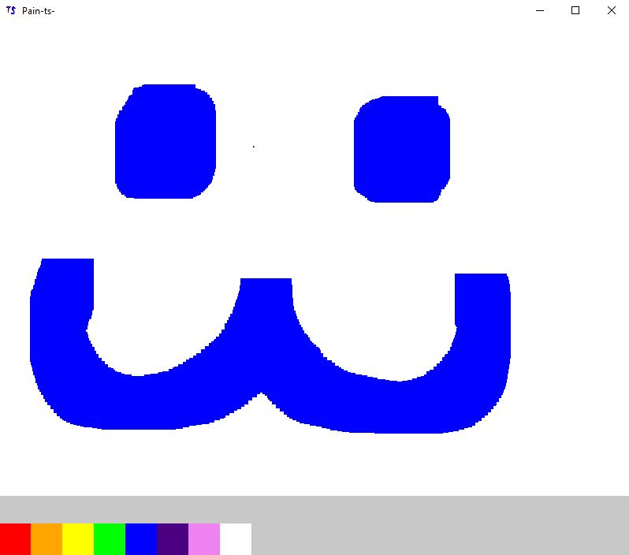

# pain-ts-

Name: Michael J. Moore

Student Number: C23373973

Class Group: TU858-2

Github: https://github.com/mjlordofthedepths

# Video

# Screenshots

# Description of the project

Inspired by software such as *Microsoft Paint 98* and *Temple-Os* as well as video-games such as *Spore* and *Ecosystem*, Pain-ts- contains a "Classic" game-mode which acts simply as a painting software and an "Eden" mode, which is currently in development.  
This Eden game-mode aims to allow players to draw worlds, creatures, and plants, and place their creatures and plants into their worlds to create a living eco-system.  
In essence, the full release of this software will contain an eco-system sandbox for the user to play around with.  
The project was made with no engine in the Rust programming language and slightly older versions of the [*winit*](https://crates.io/crates/winit) and [*pixels*](https://crates.io/crates/pixels) crates respectively for visual output.  

# Instructions for use

- Clone the repo
- Start the pain-ts-.exe file in the pain-ts- directory
- Double click your desired game-mode

# How it works:

A window is created. The user can choose a colour with which to draw.  
The pixels on the canvas will be changed to whatever colour the user is drawing with when the user left clicks.  
The user can use the scroll wheel on their mouse to increase / decrease brush size.  
The user can create transparency within the image output by selecting the last colour [Magenta] and highlighting desired transparent areas in magenta.

# List of modules/assets in the project

| Module/asset | Source |
|-----------|-----------|
| main.rs | Self written |
| input.rs | Self Written |
| draw_screen.rs | Self Written |
| sound_track.rs | Self Written* Code for playing soundtrack is self written, actual music credits below. |
| constants.rs | Self Written |
| taskbar.rs | Self Written |
| 8 Bit Nostalgia | [Fesliyan Studios](https://www.fesliyanstudios.com/royalty-free-music/download/8-bit-nostalgia/2289) |
| Retro Forests | [Fesliyan Studios](https://www.fesliyanstudios.com/royalty-free-music/download/retro-forest/451) |
| Land of 8 Bits | [Fesliyan Studios](https://www.fesliyanstudios.com/royalty-free-music/download/land-of-8-bits/288) |
| 8 Bit Presentation | [Fesliyan Studios](https://www.fesliyanstudios.com/royalty-free-music/download/8-bit-presentation/383) |

# References
* Item 1
* Item 2

# What I am most proud of in the assignment

In this project. I am most proud of creating a game without an engine for the first time.  
I have created pieces of software in the past such as my [flightTracker](https://github.com/mjLordOfTheDepths/flightTracker/blob/Main/src/main.rs) software that provided visual output without an engine,  
but that project was less ambitious and used the fltk crate rather than winit. That being said, having experience with fltk certainly made it easier to understand how winit worked.

# What I learnt

This project helped me to gauge a better understanding of more lower-level programming concepts in terms of game design.  
For example: 
When printing images onto the screen, such as the save icon, or the menu icons / logo, I learnt that if I were to use loops to copy the images onto the window, it would consume a lot of processing power and interfere with performance and frame rate.
As such, I made use of the [once_cell](https://crates.io/crates/once_cell) crate, which allowed a "lazy" form of rendering, whereby the image would be copied **once** into the desired location, as opposed to being repeatedly redrawn.

